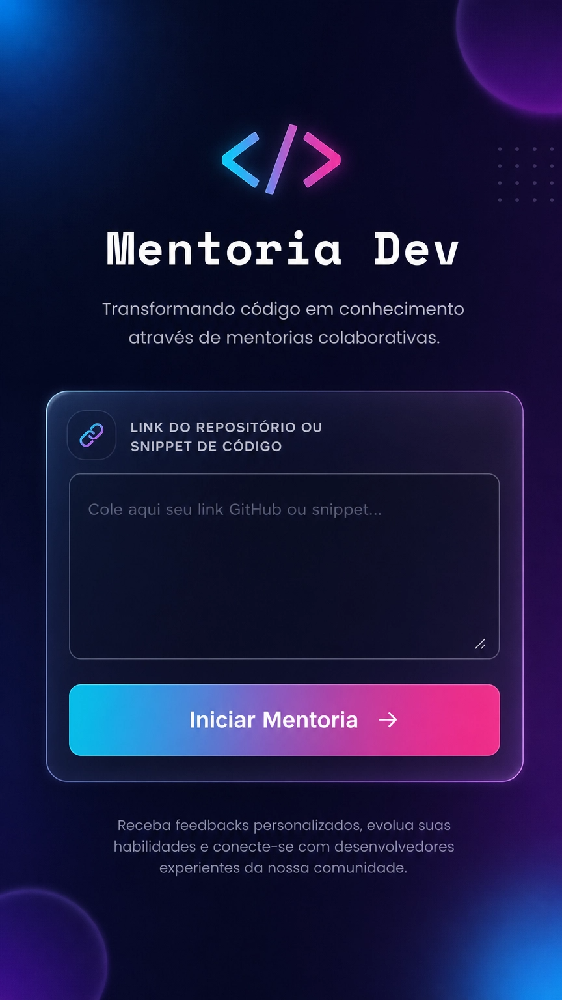
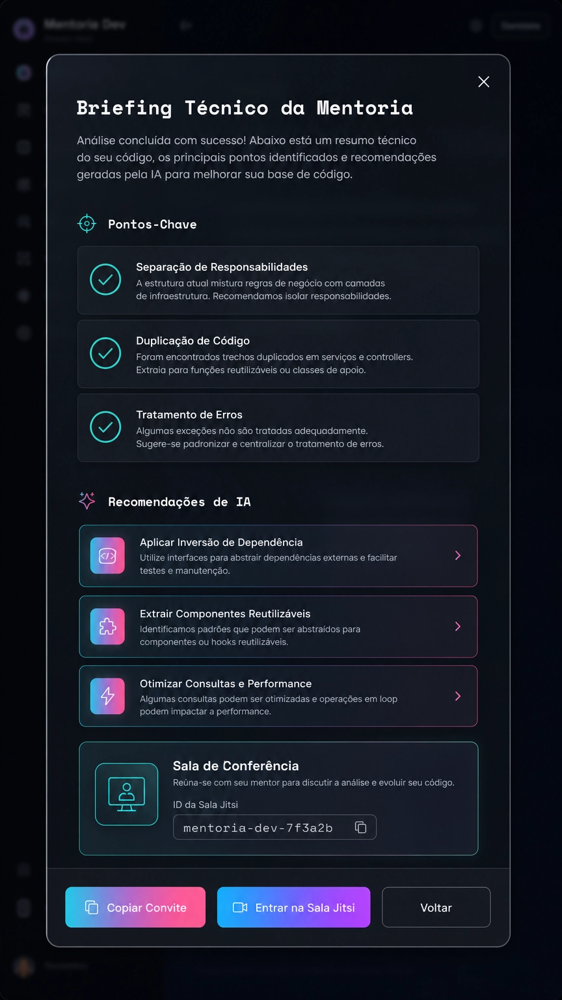
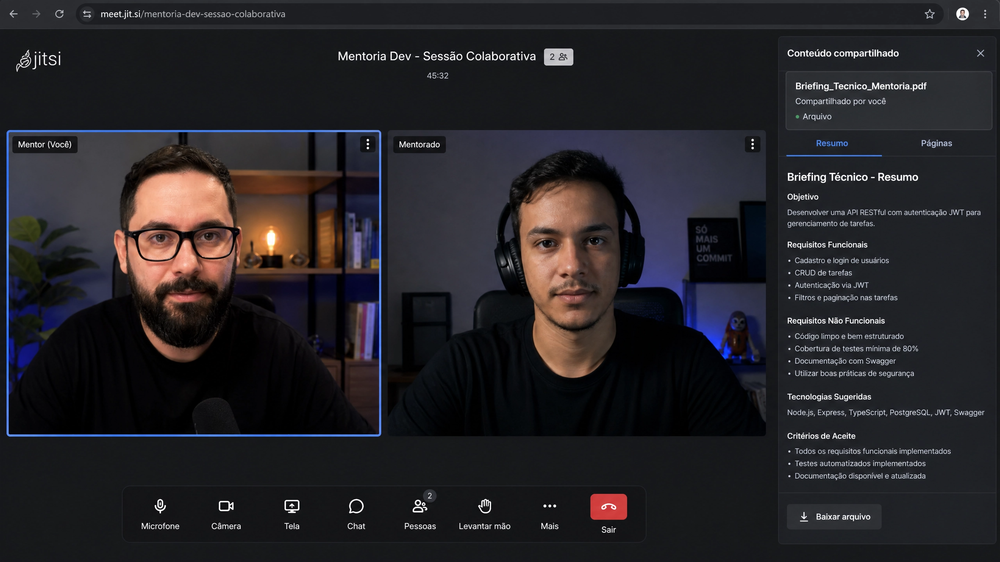

# 🚀 Mentoria Dev

**Plataforma P2P de Mentorias entre Desenvolvedores com Análise de Código por IA**

---

## 🔗 Link de Pré-visualização

```
https://3000-ixj0d4jibf78585ujwjlu-a09a44ff.us2.manus.computer
```

**Acesse agora:** [Clique aqui para abrir o app](https://3000-ixj0d4jibf78585ujwjlu-a09a44ff.us2.manus.computer)

---

## 📱 Acesso Rápido (QR Code)

Aponte a câmera do seu celular para o código abaixo e acesse o MVP funcional instantaneamente:


**Dica:** Se o QR Code não funcionar, copie e cole a URL acima no navegador do seu celular.

---

## 💡 Proposta de Valor

**IA como Facilitadora, Humanos como Protagonistas**

Mentoria Dev reconecta o que importa: **mentorias autênticas entre desenvolvedores**. 

A plataforma funciona assim:

- **Você (Mentorado)**: Cola seu código ou link do GitHub
- **IA (Manus)**: Analisa previamente e gera um Briefing Técnico com insights de Clean Code e Segurança
- **Seu Mentor (Humano)**: Recebe o briefing e entra em uma sala Jitsi Meet real
- **Resultado**: Sessão colaborativa otimizada, sem perder tempo em análise inicial

A IA não substitui o mentor—ela **prepara o terreno** para que a conversa seja profunda, focada e produtiva. Humanos discutem código. IA facilita a conversa.

---

## 📸 Demonstração do App

Abaixo, você pode visualizar as principais telas da plataforma de mentoria:

### 🖥️ 1. Interface Principal (Dark Mode)
> Design focado no desenvolvedor, utilizando Glassmorphism e paleta de cores moderna.


### 🤖 2. Briefing Técnico por IA
> Exemplo do modal de análise onde a IA prepara os pontos-chave para a mentoria.


### 🎥 3. Sala de Mentoria (Jitsi Meet)
> Integração real com videoconferência para múltiplos usuários.


---


---

## 📸 Demonstração

### Interface Dark Mode Refinada
A interface apresenta um design moderno com:
- **Fundo Gradiente**: Azul escuro (#0F172A) transitando para púrpura (#1a0f3a)
- **Glassmorphism**: Cards com efeito vidro fosco e blur backdrop
- **Tipografia Premium**: Space Mono para títulos, Montserrat para subtítulos, Poppins para corpo
- **Acessibilidade**: Alto contraste, legibilidade otimizada para desenvolvedores


### Fluxo Visual
1. **Tela Inicial**: Campo de entrada com glassmorphism + botão CTA com gradiente Ciano→Rosa
2. **Modal de Análise**: Spinner de carregamento (2s) + Briefing Técnico com pontos-chave
3. **Sala Jitsi Ativa**: Link copiável + botão para entrar na conferência em tempo real

---

## 🛠️ Instruções de Uso

### Passo 1: Contexto
O aluno (mentorado) cola o código ou link do GitHub no campo indicado:
```
Exemplo: https://github.com/usuario/projeto
ou um snippet de código JavaScript/Python/etc
```

### Passo 2: Análise
Ao clicar em **"Iniciar Mentoria"**, a IA (Manus) analisa o código e gera um **Briefing Técnico** contendo:
- ✅ **Pontos-Chave**: Estrutura, padrões e oportunidades
- ✅ **Recomendações**: 3 dicas de Clean Code e Segurança
- ✅ **Contexto**: Resumo da análise para ambos os participantes

### Passo 3: Conexão
A plataforma gera automaticamente:
- Uma **sala real no Jitsi Meet** com ID único
- Um **link de convite** que o mentorado copia e envia para seu mentor

### Passo 4: Colaboração
Mentor e mentorado entram na sala Jitsi:
- Ambos veem o **Briefing Técnico** gerado pela IA
- Discutem o código com contexto pré-preparado
- Sessão fica mais focada e produtiva
- Sem perda de tempo em análise inicial

### Exemplo de Fluxo Completo
```
1. Mentorado: "Vou compartilhar meu código"
   ↓
2. Mentorado: Cola link/snippet no app
   ↓
3. IA: Analisa e gera Briefing (2 segundos)
   ↓
4. Mentorado: Clica "Copiar Convite"
   ↓
5. Mentorado: Envia link + briefing para mentor via WhatsApp/Email
   ↓
6. Mentor: Clica no link e entra na sala Jitsi
   ↓
7. Ambos: Discutem código com briefing como guia
   ↓
8. Resultado: Mentoria otimizada e colaborativa
```

---

## 🔍 Preview de Acesso

### ⚠️ Importante
Aponte a câmera do seu celular para o **QR Code na seção 'Acesso Rápido'** acima para testar o MVP funcional agora mesmo.

### Teste Rápido (1 minuto)
1. Escaneie o QR Code com seu celular
2. Insira um link de repositório (ex: `https://github.com/facebook/react`)
3. Clique em "Iniciar Mentoria"
4. Veja o Briefing Técnico sendo gerado
5. Copie o convite e teste a sala Jitsi

### Teste Completo (5 minutos)
1. Abra o app em dois navegadores (ou dois celulares)
2. Gere um Briefing em um navegador
3. Copie o link Jitsi
4. Cole no outro navegador
5. Ambos entram na sala de conferência
6. Veja a colaboração em tempo real

---

## 🎯 Características Principais

### ✅ Implementadas
- 👥 **Modelo P2P**: Mentorias entre humanos
- 🤖 **IA nos Bastidores**: Briefing Técnico automático
- 🎥 **Jitsi Meet Colaborativo**: Sala real para múltiplos usuários
- 📱 **Mobile-First Design**: Interface responsiva e otimizada
- 🎨 **Dark Mode Refinado**: Gradientes e glassmorphism
- 📲 **QR Code de Acesso**: Convite rápido via código
- ⚡ **Performance**: Build otimizado com Vite
- 🔐 **Segurança**: URLs únicas com timestamp

### 🚀 Próximas Melhorias
- [ ] Integração real com Claude/GPT para análise de código
- [ ] Autenticação com GitHub/Google
- [ ] Histórico de mentorías
- [ ] Gravação de sessões Jitsi
- [ ] Dashboard de mentor
- [ ] Certificados de conclusão
- [ ] Marketplace de mentores
- [ ] Plugin IDE (VS Code, JetBrains)

---

## 💻 Stack Tecnológico

| Camada | Tecnologia |
|--------|-----------|
| **Frontend** | React 19 + TypeScript |
| **Styling** | Tailwind CSS 4 + shadcn/ui |
| **Build** | Vite 7 |
| **Videoconferência** | Jitsi Meet (público) |
| **QR Code** | qrcode.js |
| **Ícones** | Lucide React |
| **Animações** | Framer Motion |

---

## 📋 Requisitos para Executar Localmente

- Node.js 22.13.0+
- pnpm 10.4.1+
- Navegador moderno (Chrome, Firefox, Safari, Edge)

### Instalação Local

```bash
# Clonar repositório
git clone <repo-url>
cd mentoria-dev

# Instalar dependências
pnpm install

# Iniciar servidor de desenvolvimento
pnpm dev

# Abrir em http://localhost:3000
```

### Build para Produção

```bash
# Build otimizado
pnpm build

# Preview de produção
pnpm preview
```

---

## 🎨 Design System

### Paleta de Cores
| Elemento | Cor | Código |
|----------|-----|--------|
| Fundo | Azul Escuro | `#0F172A` |
| Gradiente | Azul → Púrpura | `#3B82F6` → `#A855F7` |
| CTA | Ciano → Rosa | `#06B6D4` → `#EC4899` |
| Texto | Branco Claro | `#F8FAFC` |

### Tipografia
- **Títulos**: Space Mono Bold
- **Subtítulos**: Montserrat SemiBold
- **Corpo**: Poppins Regular

### Componentes
- Glassmorphism: `backdrop-blur-xl bg-white/10 border border-white/20`
- Border Radius: `1rem` (suave)
- Sombras: `shadow-lg` e `shadow-xl`
- Animações: 150-300ms

---

## 📚 Documentação Completa

Para documentação técnica detalhada, consulte:
- **[TECHNICAL_DOCUMENTATION.md](./TECHNICAL_DOCUMENTATION.md)** - Arquitetura, fluxos e implementação
- **[React Docs](https://react.dev)** - Documentação do React
- **[Tailwind CSS](https://tailwindcss.com)** - Documentação de estilos
- **[Jitsi Meet API](https://jitsi.github.io/handbook/docs/dev-guide/dev-guide-iframe)** - API do Jitsi

---

## 🤝 Contribuindo

Sugestões e melhorias são bem-vindas! Para contribuir:

1. Fork o repositório
2. Crie uma branch (`git checkout -b feature/AmazingFeature`)
3. Commit suas mudanças (`git commit -m 'Add some AmazingFeature'`)
4. Push para a branch (`git push origin feature/AmazingFeature`)
5. Abra um Pull Request


## 🙏 Agradecimentos

Desenvolvido com ❤️ para a comunidade de desenvolvedores.

Obrigado aos criadores de:
- [React](https://react.dev) - Framework
- [Tailwind CSS](https://tailwindcss.com) - Styling
- [shadcn/ui](https://ui.shadcn.com) - Componentes
- [Jitsi Meet](https://jitsi.org) - Videoconferência
- [Lucide Icons](https://lucide.dev) - Ícones

---

## ✨ Visão

Mentoria Dev acredita que **o melhor aprendizado acontece entre humanos**. A IA não substitui mentores—ela os capacita. Ao automatizar a análise inicial, criamos espaço para conversas profundas, feedback genuíno e crescimento real.

**Transformando código em conhecimento através de mentorias colaborativas.**

---

**Última atualização**: 05 de Maio de 2026  
**Versão**: 2.0.0 P2P  
**Status**: ✅ MVP Funcional - Pronto para Produção  
**Desenvolvido com Manus AI**
